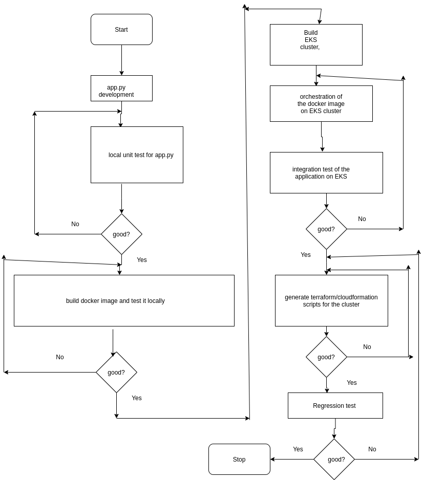
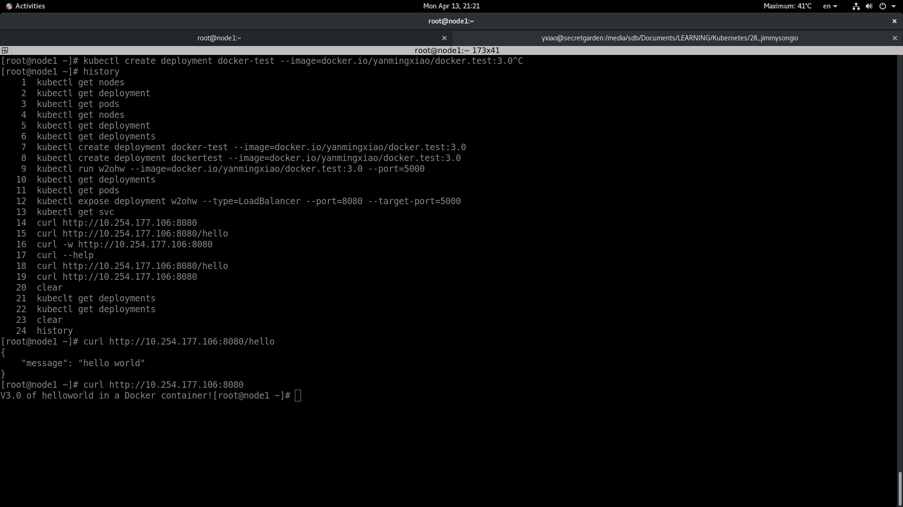
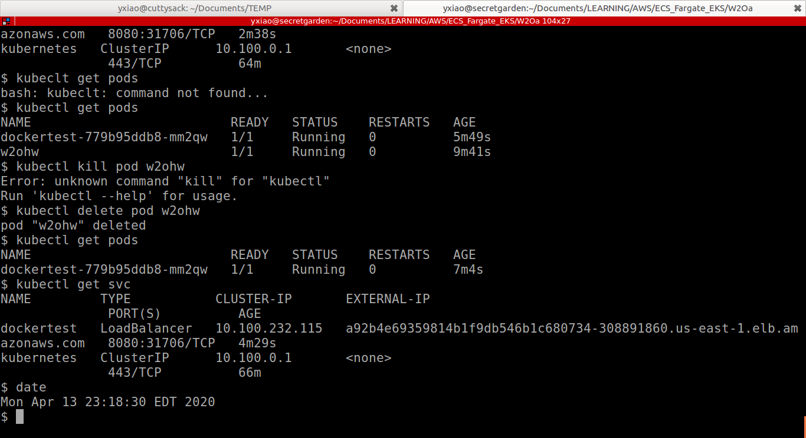

# w2ohw

The code for W2O's "Take Home Challenge to be completed by Candidate"

## Requirement
See file "w2oGroup- DevOps Test and Itinerary.pdf"

## Design Considersation

### The diagram of workflow



### Detailed Design Considersation

1. The size of the node group could be adjusted later. AutoScaling is achieved by Kubernetes Cluster Autoscaler.
2. The CloudWatch log group items could be turned on for QA stage/environment; and turned off for production environment. Metrics Server could also be installed for QA stage/environment.
3. The web security of the load balancer could be enhanced with AWS WAF. 
4. The access control to the application and EKS cluster would be fine-tuned by NACL, Security group and IAM roles. 
5. The terraform and/or cloudformation scripts are constructed based on the fine-tuned EKS cluster. 


## Docker image of the "Hello world!" application
https://hub.docker.com/r/yanmingxiao/docker.test


## Finish timestamp on a local K8S cluster

2020-04-13 21-21-29

See the timestamp on the Title bar of the file
 	"Screenshot-from-2020-04-13-21-21-29.png"





## Finish timestamp on an AWS EKS cluster


#### install eksctl
https://docs.aws.amazon.com/eks/latest/userguide/install-kubectl.html

#### install aws-iam-authenticator
https://docs.aws.amazon.com/eks/latest/userguide/install-aws-iam-authenticator.html


#### Detailed steps for EKS creation and orchestration of the application on EKS
https://docs.aws.amazon.com/eks/latest/use


```shell


$ eksctl create cluster --name w2o02 --without-nodegroup


$ eksctl get cluster w2o02
NAME	VERSION	STATUS	CREATED			VPC			SUBNETS				SECURITYGROUPS
w2o02	1.14	ACTIVE	2020-04-14T01:54:45Z	vpc-0eee5bb0ddab889a1	subnet-00f7b93aa3905a783,subnet-082e235751b82eabf,subnet-0883a895ee66d5e2e,subnet-094b9b917e7438b5c	sg-04a0536ab633d9bd0


eksctl create nodegroup \
--cluster w2o02 \
--version auto \
--name standard-workers \
--node-type t3.medium \
--node-ami auto \
--nodes 3 \
--nodes-min 1 \
--nodes-max 4


$ eksctl create nodegroup --cluster w2o02 --version auto --name standard-workers --node-type t3.medium --node-ami auto --nodes 3 --nodes-min 1 --nodes-max 4
[ℹ]  eksctl version 0.16.0
[ℹ]  using region us-east-1
[ℹ]  will use version 1.15 for new nodegroup(s) based on control plane version
[ℹ]  nodegroup "standard-workers" will use "ami-0e5bb2367e692b807" [AmazonLinux2/1.15]
[ℹ]  1 nodegroup (standard-workers) was included (based on the include/exclude rules)
[ℹ]  will create a CloudFormation stack for each of 1 nodegroups in cluster "w2o02"
[ℹ]  2 sequential tasks: { fix cluster compatibility, 1 task: { 1 task: { create nodegroup "standard-workers" } } }
[ℹ]  checking cluster stack for missing resources
[ℹ]  cluster stack is missing resources for Fargate
[ℹ]  adding missing resources to cluster stack
[ℹ]  re-building cluster stack "eksctl-w2o02-cluster"
[✔]  all resources in cluster stack "eksctl-w2o02-cluster" are up-to-date
[ℹ]  building nodegroup stack "eksctl-w2o02-nodegroup-standard-workers"
[ℹ]  deploying stack "eksctl-w2o02-nodegroup-standard-workers"
[ℹ]  adding identity "arn:aws:iam::965031037346:role/eksctl-w2o02-nodegroup-standard-w-NodeInstanceRole-17VZBHBB6EOMS" to auth ConfigMap
[ℹ]  nodegroup "standard-workers" has 0 node(s)
[ℹ]  waiting for at least 1 node(s) to become ready in "standard-workers"
[ℹ]  nodegroup "standard-workers" has 3 node(s)
[ℹ]  node "ip-192-168-5-105.ec2.internal" is not ready
[ℹ]  node "ip-192-168-5-90.ec2.internal" is not ready
[ℹ]  node "ip-192-168-53-41.ec2.internal" is ready
[✔]  created 1 nodegroup(s) in cluster "w2o02"
[✔]  created 0 managed nodegroup(s) in cluster "w2o02"
[ℹ]  checking security group configuration for all nodegroups
[ℹ]  all nodegroups have up-to-date configuration

$ kubectl get nodes
NAME                            STATUS   ROLES    AGE   VERSION
ip-192-168-5-105.ec2.internal   Ready    <none>   59s   v1.15.10-eks-bac369
ip-192-168-5-90.ec2.internal    Ready    <none>   61s   v1.15.10-eks-bac369
ip-192-168-53-41.ec2.internal   Ready    <none>   62s   v1.15.10-eks-bac369
$ kubectl get svc
NAME         TYPE        CLUSTER-IP   EXTERNAL-IP   PORT(S)   AGE
kubernetes   ClusterIP   10.100.0.1   <none>        443/TCP   53m


$ kubectl create deployment dockertest --image=docker.io/yanmingxiao/docker.test:3.0
deployment.apps/dockertest created

$ kubectl get deployments
NAME         READY   UP-TO-DATE   AVAILABLE   AGE
dockertest   0/1     1            0           19s

$ kubectl get deployments
NAME         READY   UP-TO-DATE   AVAILABLE   AGE
dockertest   1/1     1            1           2m25s

$ kubectl expose deployment dockertest --type=LoadBalancer --port=8080 --target-port=5000
service/dockertest exposed

$ kubectl get svc
NAME         TYPE           CLUSTER-IP       EXTERNAL-IP                                                              PORT(S)          AGE
dockertest   LoadBalancer   10.100.232.115   a92b4e69359814b1f9db546b1c680734-308891860.us-east-1.elb.amazonaws.com   8080:31706/TCP   10s
kubernetes   ClusterIP      10.100.0.1       <none>                                                                   443/TCP          61m

$ curl http://a92b4e69359814b1f9db546b1c680734-308891860.us-east-1.elb.amazonaws.com:8080/hello
{
    "message": "hello world"
}
$ curl http://a92b4e69359814b1f9db546b1c680734-308891860.us-east-1.elb.amazonaws.com:8080
V3.0 of helloworld in a Docker container!$ 


$ date
Mon Apr 13 23:18:30 EDT 2020

```



